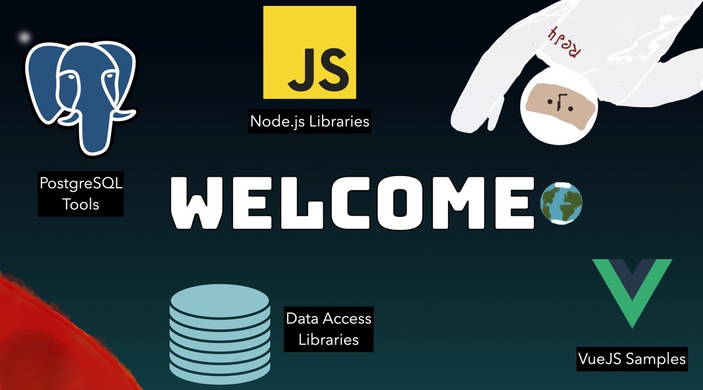

Hello and welcome to my GitHub repo. My name is Rob Conery and I work at Microsoft with the VS Code team, making videos, open source tools, workshops, and anything that might seem helpful to our developers. 

## Recent Projects

There is a lot in this repo, but here's what I've been working on recently you might find useful:

 - [Firefly](https://github.com/robconery/Firefly), which is a super simple Node.js library for working with Firestore in an ActiveRecord-y  way (using the admin SDK from the server).
 - [My Node.js Starter App](https://github.com/robconery/node-pg-start). I made this for myself a few years ago and decided to share. Comes ready to roll with Tailwind, loggging, auth, and more.
 - [The Copilot PostgreSQL chat participant](https://github.com/robconery/copilot-pg) or `@pg`, which lets you "chat" with your database and even run queries!
 - [dox](https://github.com/robconery/dox), which is a set of functions that mimic the MongoDB API, allowing you to work in PostgreSQL as if you were working in MongoDB

There are some other fun things in there, so have a look around!

## Me, Online

I have [a blog/newsletter](https://robconery.com) that where I write about things I'm learning in the world of Computer Science. You can also find me on [Bluesky](https://bsky.app/profile/robconery.com).

I like to made videos whenever possible and [post them to my YouTube channel](https://www.youtube.com/@rconery). I wish I could do this more!

 
